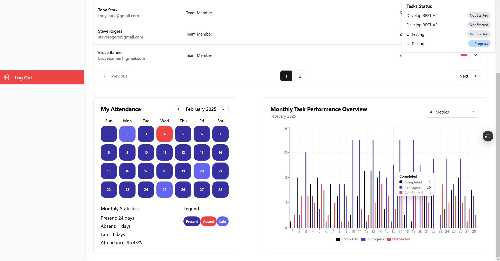
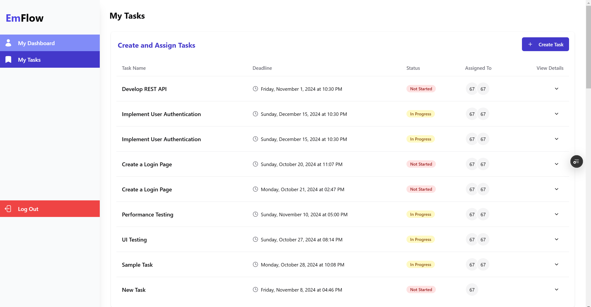

# EmpFlow-ETM

EmpFlow-ETM is a project designed to manage employee workflows and task management effectively. This repository primarily consists of JavaScript code, with some CSS and other minor components.

## Table of Contents

- [Introduction](#introduction)
- [Features](#features)
- [Installation](#installation)
- [Usage](#usage)
- [Contributing](#contributing)
- [License](#license)
- [Contact](#contact)

## Introduction

EmpFlow-ETM is an easy-to-use application designed to streamline employee task management and workflow processes. It provides tools and features to improve productivity and efficiency in managing tasks and workflows within an organization.

## Features

- Task creation and assignment
- Workflow management
- Employee performance tracking
- Real-time notifications
- Interactive dashboards
- User-friendly interface

## Installation

To get started with EmpFlow-ETM, follow these steps:

1. Clone the repository:
    ```sh
    git clone https://github.com/HarVkr/EmpFlow-ETM.git
    ```
2. Navigate to the project directory:
    ```sh
    cd EmpFlow-ETM
    ```
3. Install the dependencies:
    ```sh
    npm install
    ```

## App Screenshots

Here are some screenshots of the app:






## Usage

After installing the dependencies, you can start the application by running:

```sh
npm start
```

This will start the application on your local server. Open your web browser and go to `http://localhost:3000` to access the application.

## Contributing

We welcome contributions to improve EmpFlow-ETM. If you have suggestions, bug reports, or feature requests, please open an issue or submit a pull request. Follow these steps to contribute:

1. Fork the repository.
2. Create a new branch:
    ```sh
    git checkout -b feature/your-feature-name
    ```
3. Make your changes and commit them:
    ```sh
    git commit -m 'Add some feature'
    ```
4. Push to the branch:
    ```sh
    git push origin feature/your-feature-name
    ```
5. Open a pull request.

## License

EmpFlow-ETM is licensed under the MIT License. See the [LICENSE](LICENSE) file for more information.

## Contact

For any questions or inquiries, please contact the project maintainer:

- **GitHub**: [HarVkr](https://github.com/HarVkr)
