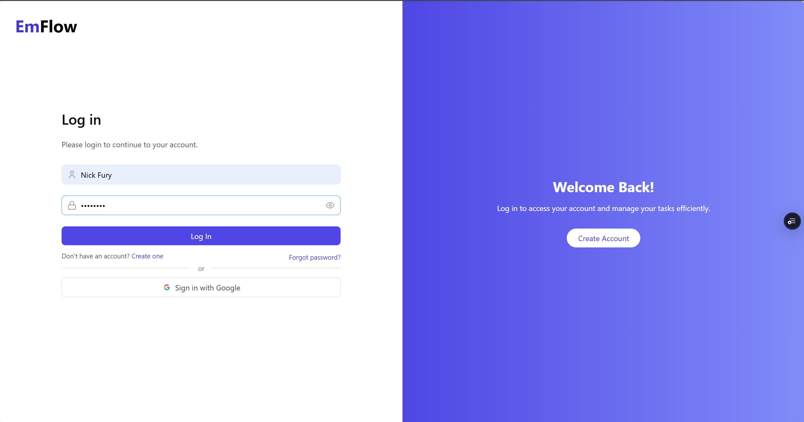
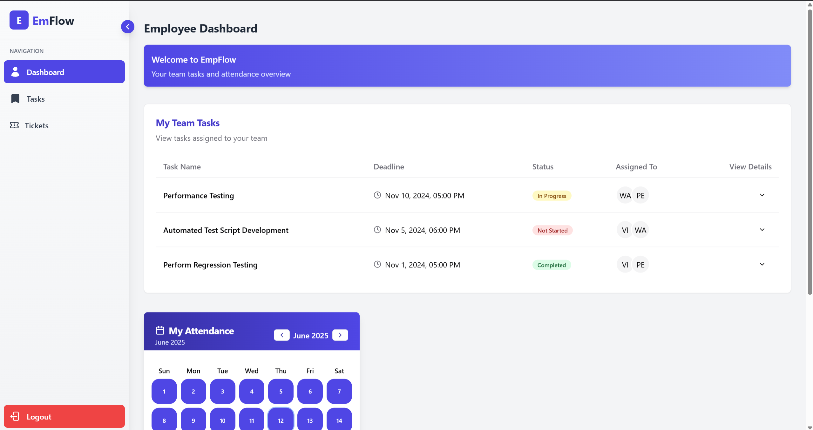
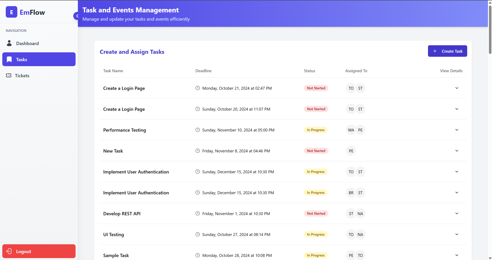
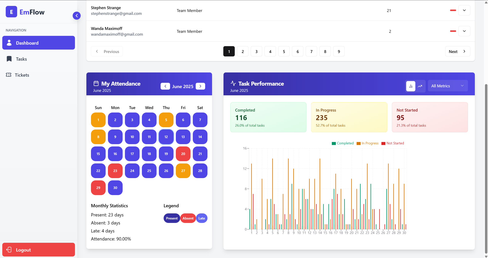
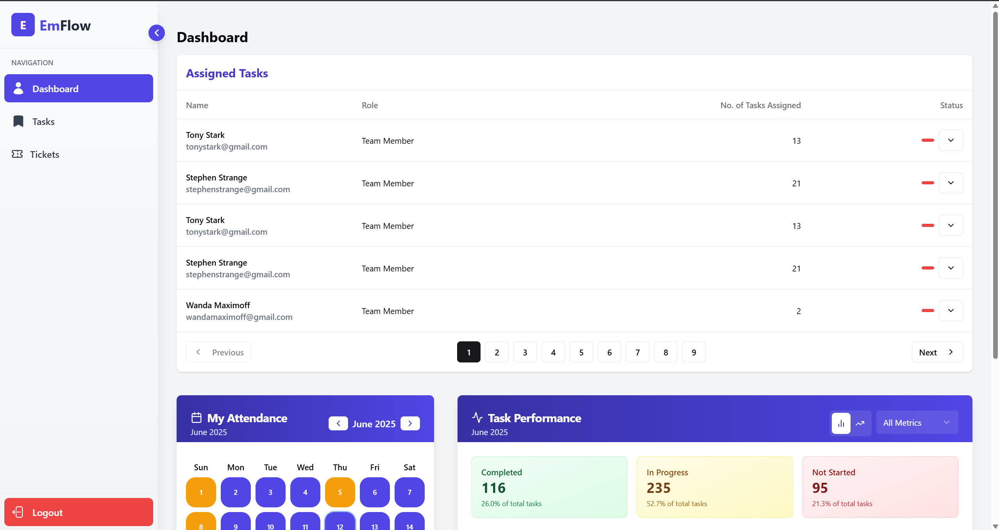
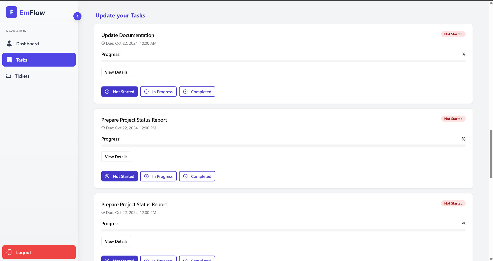
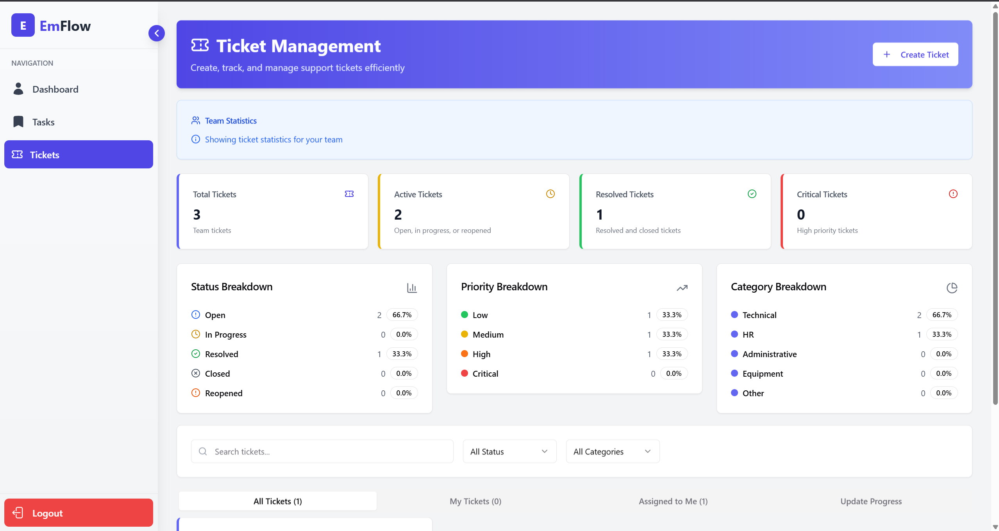
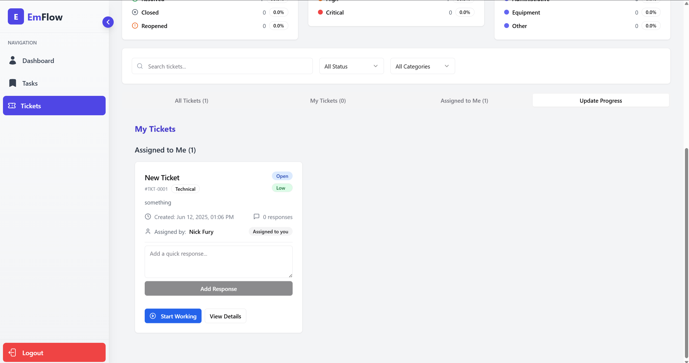
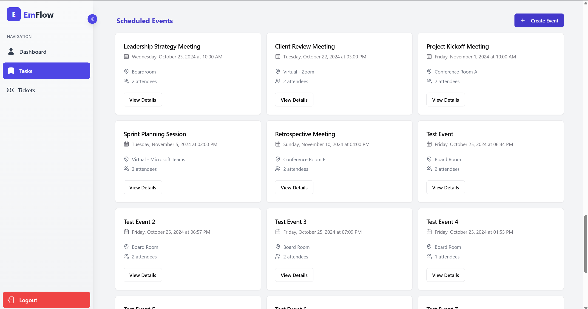

# EmFlow-ETM

EmFlow-ETM is a robust, full-stack Employee Workflow and Task Management solution engineered to optimize workforce productivity through automation and real-time collaboration. Built primarily with the MERN stack (MongoDB, Express.js, React.js, Node.js), the application leverages modern JavaScript (ES6+), RESTful APIs, and state-of-the-art front-end design with responsive CSS modules. EmpFlow-ETM integrates modular components for user authentication, role-based access control (RBAC), and dynamic dashboards, ensuring a seamless experience for both managers and employees. 

## Table of Contents

- [Introduction](#introduction)
- [Features](#features)
- [Installation](#installation)
- [Usage](#usage)
- [Contributing](#contributing)
- [License](#license)
- [Contact](#contact)

## Introduction

EmFlow-ETM is designed to streamline and digitalize employee task management, event scheduling, and ticket handling within organizations. The application utilizes a modular React.js front-end, communicating efficiently with a RESTful Express.js/Node.js backend API. MongoDB serves as the primary datastore, facilitating flexible schema designs for tasks, tickets, events, and user roles. Features such as task assignment and progress tracking are powered by centralized state management (using Redux or React Context API). The system employs JWT-based authentication and RBAC to ensure secure and granular access to features. Comprehensive dashboards provide actionable insights, leveraging data aggregation pipelines and responsive charting libraries. The UI/UX is crafted with reusable React components, modern CSS, and accessibility in mind, making EmpFlow-ETM an enterprise-ready solution for scalable task and workflow management.

## Features

- Task Creation and Assignment
- Tasks Progress Updation and Tracking
- Event Creation and Real-time Notifications
- Employee performance tracking
- Tickets Creation and Assignment
- Tickets Updation
- Interactive dashboards
- User-friendly interface

## Installation

To get started with EmpFlow-ETM, follow these steps:

1. Clone the repository:
    ```sh
    git clone https://github.com/HarVkr/EmpFlow-ETM.git
    ```
2. Navigate to the project directory:
    ```sh
    cd EmpFlow-ETM
    ```
3. Install the dependencies:
    ```sh
    npm install
    ```

## Snippets of Web App 

#### Login Page

#### Tasks Assigned to the Employee's Team

#### Manager Dashboard Task Creation

#### Manager Dashboard Attendance and Performance Overview

#### Manager Dashboard Assigned Tasks to their Team

#### Employee (Manager/Team Member) Own Tasks Updation and Tracking

#### Employee Tickets Management

#### Employee Tickets View

#### Employee Ticket Updation

#### Manager Dashboard Event Creation



## Usage

After installing the dependencies, you can start the application by running:

```sh
npm start
```

This will start the application on your local server. Open your web browser and go to `http://localhost:3000` to access the application.

## Contributing

We welcome contributions to improve EmpFlow-ETM. If you have suggestions, bug reports, or feature requests, please open an issue or submit a pull request. Follow these steps to contribute:

1. Fork the repository.
2. Create a new branch:
    ```sh
    git checkout -b feature/your-feature-name
    ```
3. Make your changes and commit them:
    ```sh
    git commit -m 'Add some feature'
    ```
4. Push to the branch:
    ```sh
    git push origin feature/your-feature-name
    ```
5. Open a pull request.

## License

EmFlow-ETM is licensed under the MIT License. See the [LICENSE](LICENSE) file for more information.

## Contact

For any questions or inquiries, please contact the project maintainer:

- **GitHub**: [HarVkr](https://github.com/HarVkr)
